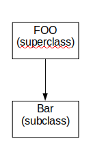
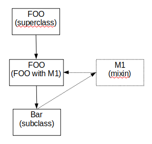

# Mixin C#

## ¿Qué es **mixin**?

En los lenguajes de programación orientada a objetos, un Mixin es una clase que **ofrece cierta funcionalidad** para ser heredada por una subclase, pero no está ideada para ser autónoma. Heredar de un Mixin **no es una forma de especialización** sino más bien un medio de obtener funcionalidad. Una subclase puede incluso escoger heredar gran parte o el total de su funcionalidad heredando de uno o más Mixins mediante herencia múltiple.

Supongamos que tenemos la clase **`Foo`** de la cual hereda **`Bar`**:



¿Cómo podemos agregarle una funcionalidad a **`Foo`** de forma tal que podamos heredarla a través de **`Bar`**?



En la imagen anterior observamos lo siguiente:

- En este caso **`M1`** es una clase que añade funcionalidad.
- Ahora **`Bar`** no hereda directamente de **`Foo`**, o sea, **`Bar`** no es subclase de **`Foo`**, sino una combinación entre **`Foo`** y **`M1`**.
- **`Foo`** no es la superclase de **`Bar`**, sino que en su lugar, lo es el **mixin** (la combinación) de **`Foo-with-M1`**.

## Pseudo-Mixin en C# 3.0

Como en C# no existe la herencia múltiple, una forma de recrear este patrón es crear interfaces con diferentes funcionalidades. Utilizaremos como ejemplo ilustrativo una estructura de árbol binario. Veamos dicha estructura:


En este caso utilizamos una definición recursiva de árbol binario, donde un árbol binario es un valor genérico (**`T Value`**) con un subárbol izquierdo (**`IBinaryTree<T> Left`**) y otro subárbol derecho (**`IBinaryTree<T> Right`**). Destacar que vimos necesaria una funcionalidad mínima de insertar valores. Además se plantea la restricción de que el tipo **`T`** debe ser capaz de compararse consigo mismo.

```c#
public interface IBinaryTree<T> where T : IComparable<T>{
    T Value { get; set; }
    IBinaryTree<T> Left { get; set; }
    IBinaryTree<T> Right { get; set; }
    void Insert(T value);
}
```

Sobre esta interfaz planteamos la siguiente implementación:

```c#
public class BinaryTree<T> : IBinaryTreeIterator<T>, IBinaryTreeHeigth<T> where T : IComparable<T> {
        public T Value { get; set; }
        public IBinaryTree<T> Left { get; set; }
        public IBinaryTree<T> Right { get; set; }

        public BinaryTree(T value) {
            Value = value;
        }

        public virtual void Insert(T value) {
            if (value.CompareTo(Value) == -1) {
                if (Left == null) {
                    Left = new BinaryTree<T>(value);
                }
                else {
                    Left.Insert(value);
                }
            }
            else {
                if (Right == null) {
                    Right = new BinaryTree<T>(value);
                }
                else {
                    Right.Insert(value);
                }
            }
        }
    }
```

### Iterar sobre los nodos del árbol de modo ***lazy*** y calcular su altura

Uno de los objetivos de la implementación de una funcionalidad es poder decidir su uso o no, por ello planteamos la siguiente solución:

Declarar una interfaz **`IBinaryTreeIterator<T>`** a la cual le agregaremos las funcionalidades de iteración mediante la clase contenedora **`Iterators`**. También declaramos la interfaz **` IBinaryTreeHeigth<T>`**  a la cual le agregamos la funcionalidad de calcular la altura mediante la clase contenedora **`Metrics`**.

```c#
public interface IBinaryTreeIterator<T> : IBinaryTree<T> where T : IComparable<T> { }
```
```c#
public interface IBinaryTreeHeigth<T> : IBinaryTree<T> where T : IComparable<T> { }
```
```c#
public static class Iterators {
        public static IEnumerable<T> PreOrder<T>(this IBinaryTreeIterator<T> tree) where T : IComparable<T> {
            yield return tree.Value;

            if (tree.Left != null) {
                foreach (var item in PreOrder<T>((IBinaryTreeIterator<T>) tree.Left)) {
                    yield return item;
                }
            }

            if (tree.Right != null) {
                foreach (var item in PreOrder<T>((IBinaryTreeIterator<T>) tree.Right)) {
                    yield return item;
                }
            }
        }

        public static IEnumerable<T> InOrder<T>(this IBinaryTreeIterator<T> tree) where T : IComparable<T> {
            if (tree.Left != null) {
                foreach (var item in InOrder<T>((IBinaryTreeIterator<T>) tree.Left)) {
                    yield return item;
                }
            }

            yield return tree.Value;

            if (tree.Right != null) {
                foreach (var item in InOrder<T>((IBinaryTreeIterator<T>) tree.Right)) {
                    yield return item;
                }
            }
        }

        public static IEnumerable<T> PostOrder<T>(this IBinaryTreeIterator<T> tree) where T : IComparable<T> {
            if (tree.Left != null) {
                foreach (var item in PostOrder<T>((IBinaryTreeIterator<T>) tree.Left)) {
                    yield return item;
                }
            }


            if (tree.Right != null) {
                foreach (var item in PostOrder<T>((IBinaryTreeIterator<T>) tree.Right)) {
                    yield return item;
                }
            }

            yield return tree.Value;
        }
    }
```
```c#
public static class Metrics {
    public static int Heigth<T>(this IBinaryTreeHeigth<T> tree) where T : IComparable<T> {
        if (tree == null)
            return 0;
        return 1 + Math.Max(Heigth((IBinaryTreeHeigth<T>) tree.Left), Heigth((IBinaryTreeHeigth<T>) tree.Right));
    }
}
```

En el ejemplo anterior hicimos uso de los métodos extensores. Esto se debe a que los métodos extensores permiten agregar funcionalidades nuevas a tipos previamente declarados o implementados. Deben ser declarados en una clase con el modificador **`static`** al igual que la definición de la funcionalidad. Además del modificador **`static`**, en la declaración de los métodos extensores se destaca que deben tener como primer argumento el tipo al cual queremos agregar la funcionalidad, además de ponerle el modificador **`this`** delante.

Con esta implementación hasta el momento, se puede ejecutar el siguiente código:

```c#
var bt = new BinaryTree<int>(5);
bt.Insert(4);
bt.Insert(7);
bt.Insert(1);
foreach (var value in bt.PreOrder())
    Console.WriteLine(value);
Console.WriteLine("Heigth = {0}", bt.Heigth());
```
*Output:*
```
5
4
1
7
Heigth = 3
```

En caso que se quiera desactivar una funcionalidad, solamente tenemos que dejar de implementar la interfaz correspondiente. En este caso por ejemplo, si se quiere quitar los iteradores basta con declarar la clase como:

```c#
public class BinaryTree<T> : IBinaryTreeHeigth<T> where T : IComparable<T> {
    ...
    ...
}
```

En este caso tenemos el código de la clase **`BinaryTree<T>`** por lo que nos fue fácil agregar o quitar funcionalidades. Pero ¿qué pasaría si no tenemos el código fuente de la clase? ¿Seguimos teniendo la posibilidad de lograr el mismo comportamiento? Para el caso de no tener el código o no querer modificarlo tendríamos que crear una nueva clase (por ejemplo **`MyBinaryTree<T>`**) que herede de **`BinaryTree<T>`**, la cual incorporaría las funcionalidades. Quedando como se muestra a continuación:

```c#
public class BinaryTree<T> : IBinaryTree<T> where T : IComparable<T> { ... }

public class MyBinaryTree<T> : BinaryTree<T>, IBinaryTreeIterator<T>, IBinaryTreeHeigth<T> where T : IComparable<T> {

    public MyBinaryTree(T value) : base(value) { }

    public override void Insert(T value) {
        if (value.CompareTo(Value) == -1) {
            if (Left == null) {
                Left = new MyBinaryTree<T>(value);
            }
            else {
                Left.Insert(value);
            }
        }
        else {
            if (Right == null) {
                Right = new MyBinaryTree<T>(value);
            }
            else {
                Right.Insert(value);
            }
        }
    }
}
```

Con las definiciones anteriores comprobamos que el siguiente código funciona:

```c#
var mbt = new MyBinaryTree<int>(5);
    mbt.Insert(4);
    mbt.Insert(7);
    mbt.Insert(1);
    foreach (var value in mbt.PreOrder())
        Console.WriteLine(value);
    Console.WriteLine("Heigth = {0}", mbt.Heigth());
```

*Output:*
```
5
4
1
7
Heigth = 3
```


## Ventajas y desventajas respecto a la herencia múltiple

* Ventajas de la herencia múltiple
    - Una de las principales ventajas de la herencia múltiple es que cada una de las clases que aportan funcionalidad pueden ser instanciadas, aunque no sea exactamente lo que se quiere lograr con mixin.
    - Además se pueden utilizar los campos de la clase que agrega la funcionalidad, siempre respetando los modificadores de visibilidad.

* Ventajas del mixin
    - Es muy útil para la reutilización de código sin tener que ensuciarse las manos con la semántica de la herencia múltiple.
    - También es práctico por permitir añadir funcionalidades a clases que ya existían previamente, sin modificar su declaración.

**Consideramos que las desventajas de cada uno de ellos es lo opuesto a las ventajas del otro :)**. Además es muy subjetivo el planteamiento de desventajas, ya que depende completamente del contexto de uso. Después de todo mixin es un patrón de diseño que se utiliza solo si es factible.

## ¿Tienen sentido/utilidad los mixins en un lenguaje con herencia múltiple?

Sí tiene sentido, ya que uno de los posibles escenarios que se resuelve con mixin es el *problema del diamante*. Se agrega una funcionalidad directamente sin involucrar al resto de funcionalidades que intervendrían en la herencia.

## Refactorizando código en C++

La refactorización de una jerarquía con herencia múltiple en C++ puede ser representada en C# mediante interfaces como se muestra a continuación:

```c++
class A {
    int a;
    void M1() { ... }
}

class B {
    int b;
    void M2() { ... }
}

class C: A,B { ... }
```

```c#
interface IA {
    int A { get; set; }
}

interface IB {
    int B { get; set; }
}

class C : IA, IB {
    public int A { get; set; }
    public int B { get; set; }
}

static class Methods {
    public static void M1(this IA ia) {
        ...
    }

    public static void M2(this IB ib) {
        ...
    }
}
```

## ¿Qué desventajas tienen el uso de métodos extensores en C#?

- Una de las desventajas es que hay que cargar el namespace completo que lo contiene, aunque sea lo único que se utilice.
- La colisión de estructura puede provocar que un método extensor nunca pueda ser utilizado. Esto sucede si la signatura (nombre y argumentos) del método extensor coincide con alguno de la clase o interfaz.
- Los métodos extensores solo pueden ser eso, métodos. No se pueden declarar operadores, indexadores o propiedades.
